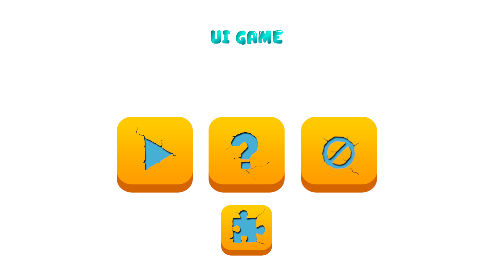
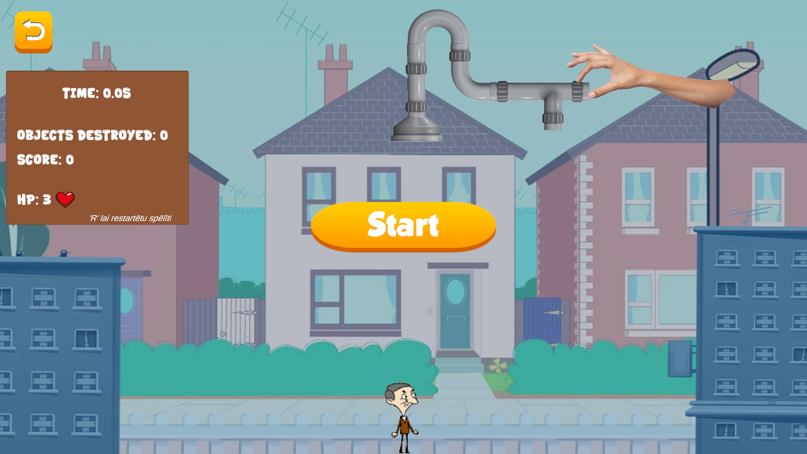
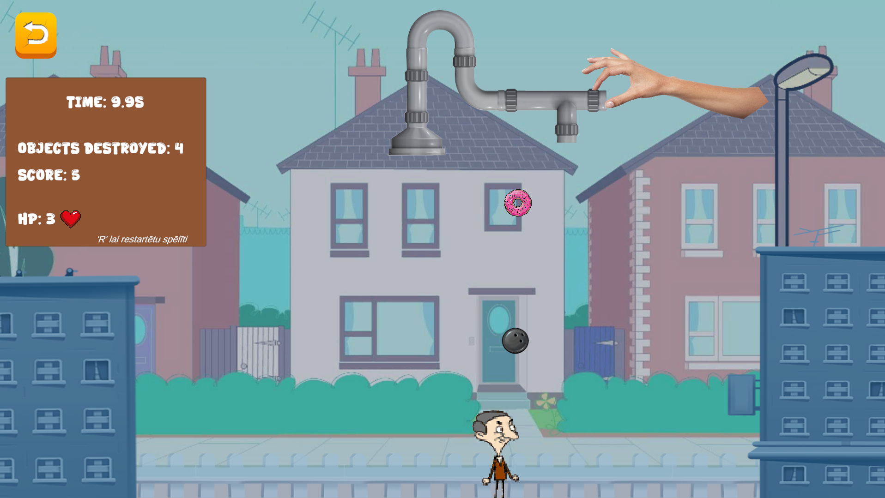
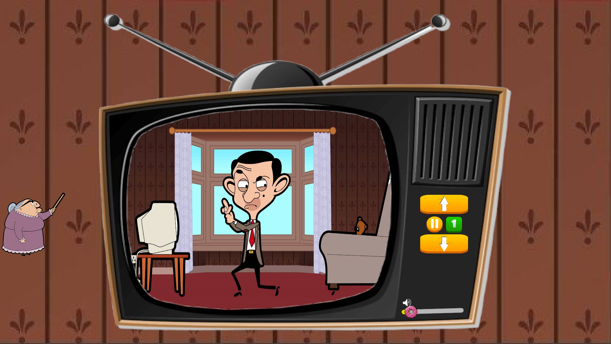
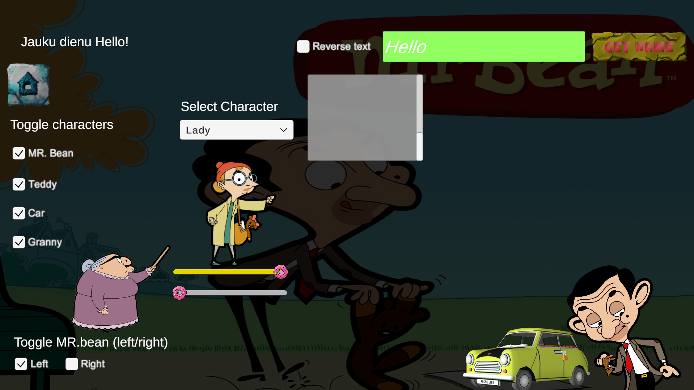

# Unity Learning Bean Programma

Unity 2D spēle, kurā spēlētājs var apskatīt UI sadaļu, kā arī spēlēt "Mr.Bean Virtuļu ķeršanas Spēlīti", lai noķertu pēc iespējas vairāk krītošu virtuļu, vienlaikus izvairoties no bīstamiem objektiem. Spēle izstrādāta izmantojot UI elementus un pasaules fiziku.

**Darāmo darbu saraksts:**
- [X] UI Button lietojums
- [X] UI Input field lietojums
- [X] UI Text lietojums
- [X] UI Image lietojums
- [X] UI Radio button lietojums
- [X] UI Slider lietojums
- [X] Drag and drop funkcionilitāte
- [X] Audio source lietojums
- [X] Riggid body un collider lietojums
- [X] Projekta sagatavošana Windows OS
- [X] Izveidot galvenās izvelnes ainu (paši)
- [X] Izveidot TV ainu (paši)
- [X] Integrēt virtuļu ķeršanu spēli

## 📸 Ekrānšāviņi 📸

### Galvenā izvēlne

### Virtuļu ķeršanas spēle

### Mr. Bean TV aina

### UI Aina

## Kā palaist šo projektu

1. Lejupielādē Release vai klonē šo repozitoriju.
2. Atver mapi ar **Unity Editor** (ieteicams 2022.3 LTS vai jaunāks), es izmantoju Unity 6.3 LTS.
3. Tālāk vari palaist projektu un cerams ka viss strādās!

## Licence

Šis projekts ir izveidots priekš mācīšanās. Vari brīvi izmantot un modificēt šo kodu :).
